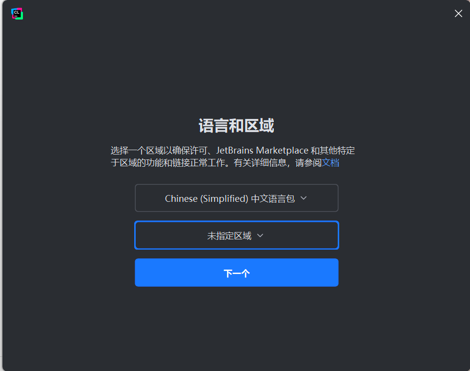
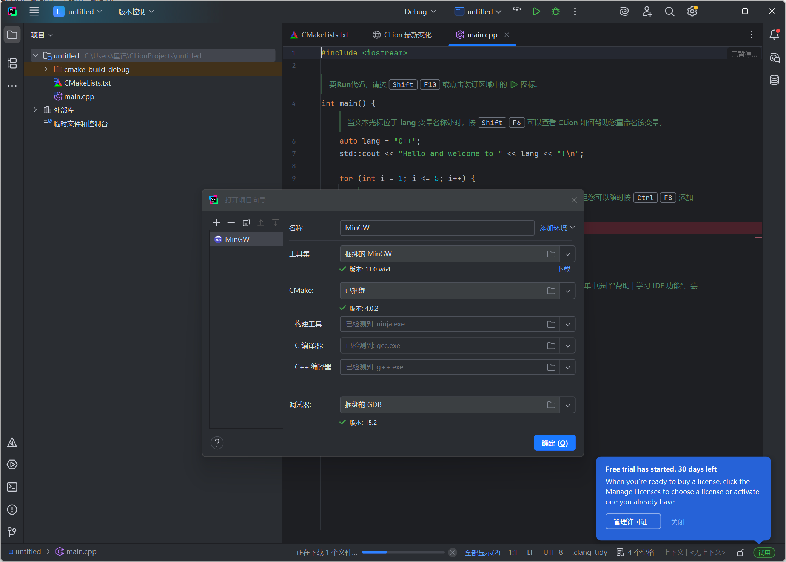
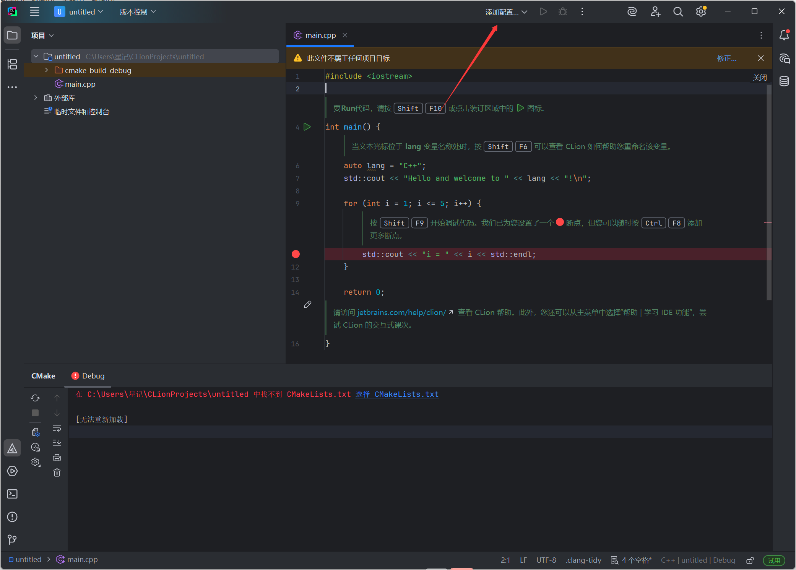
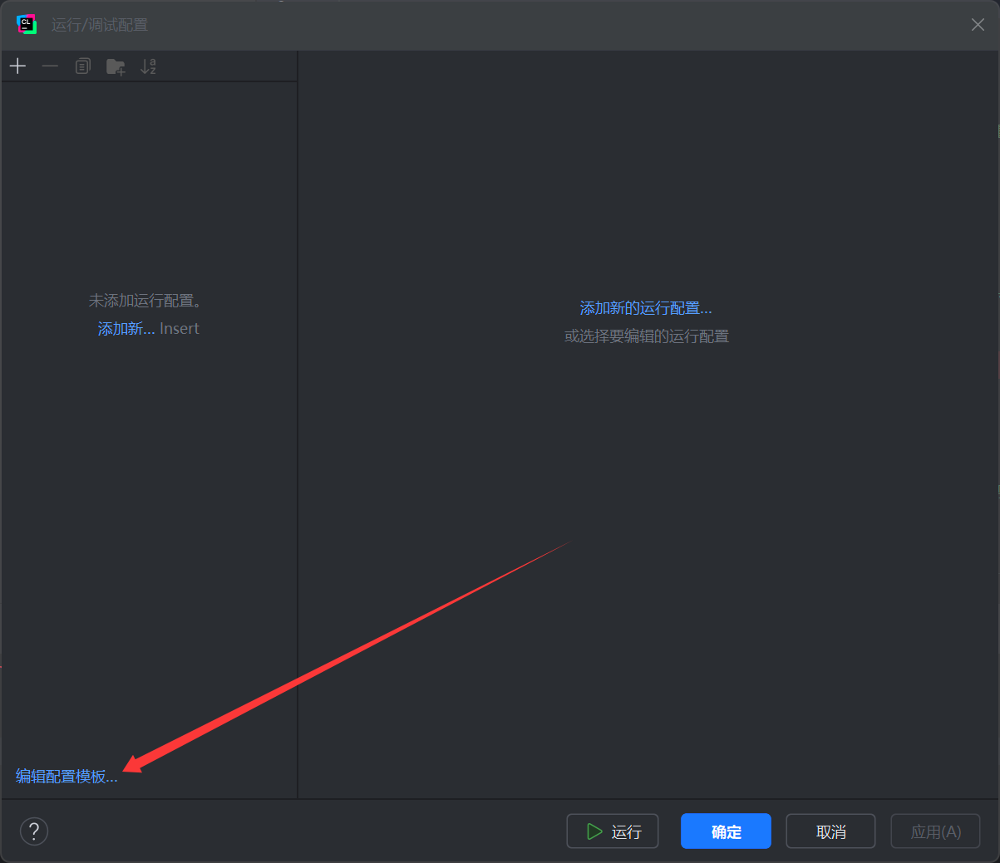
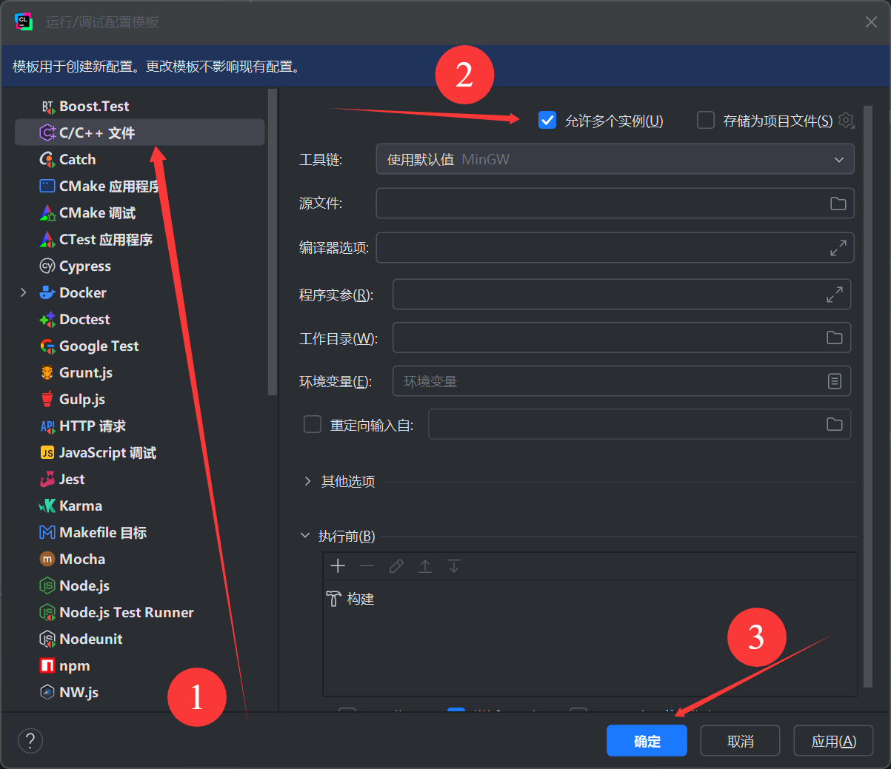
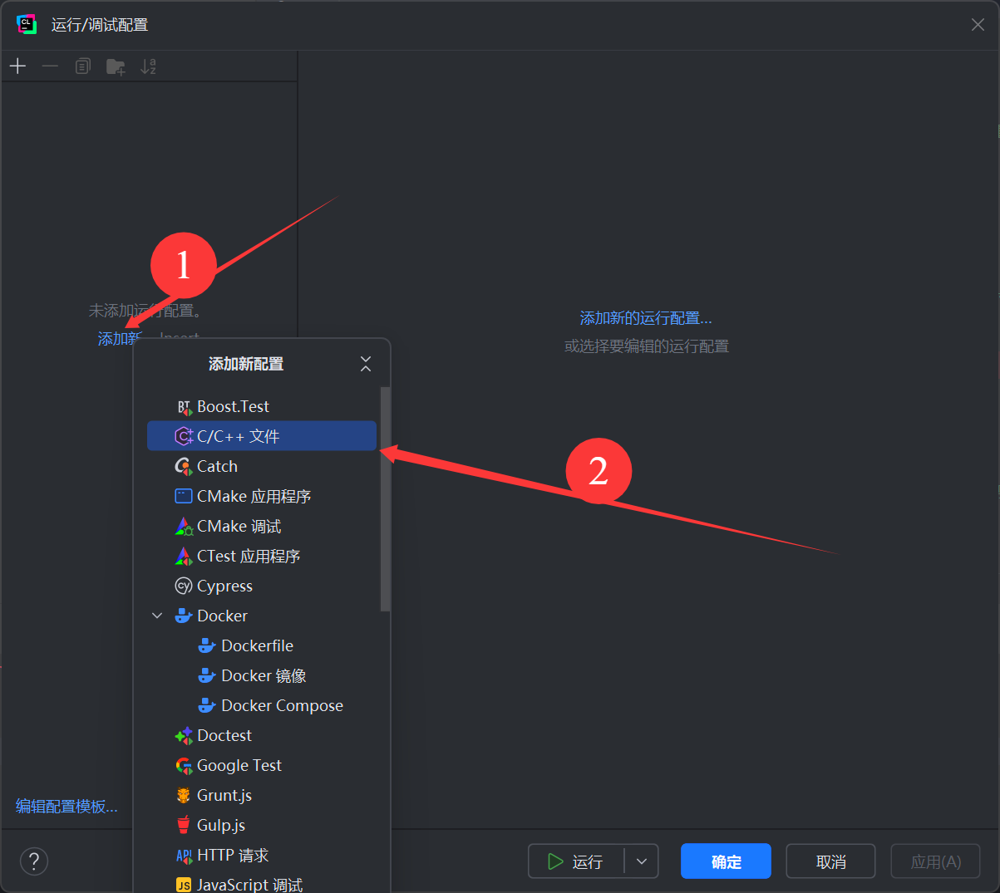
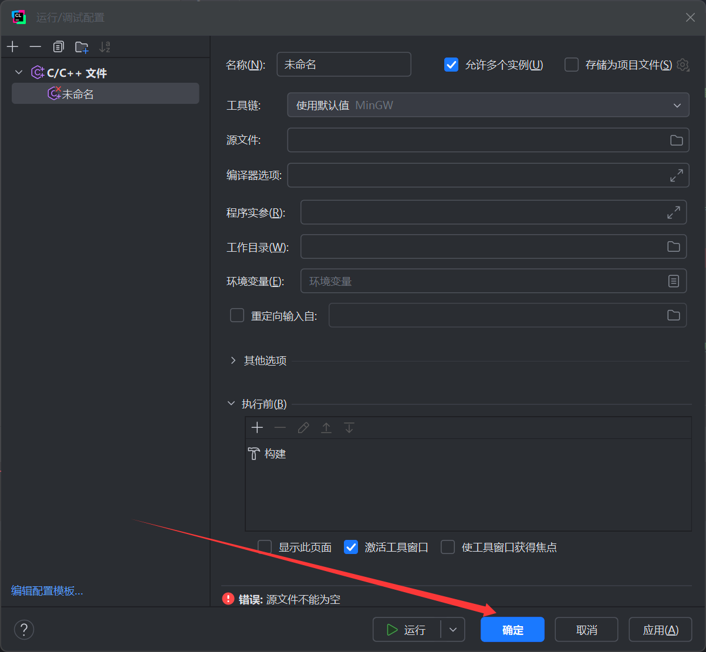
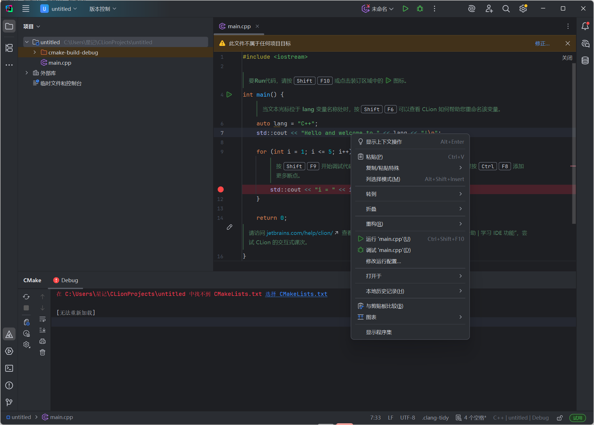
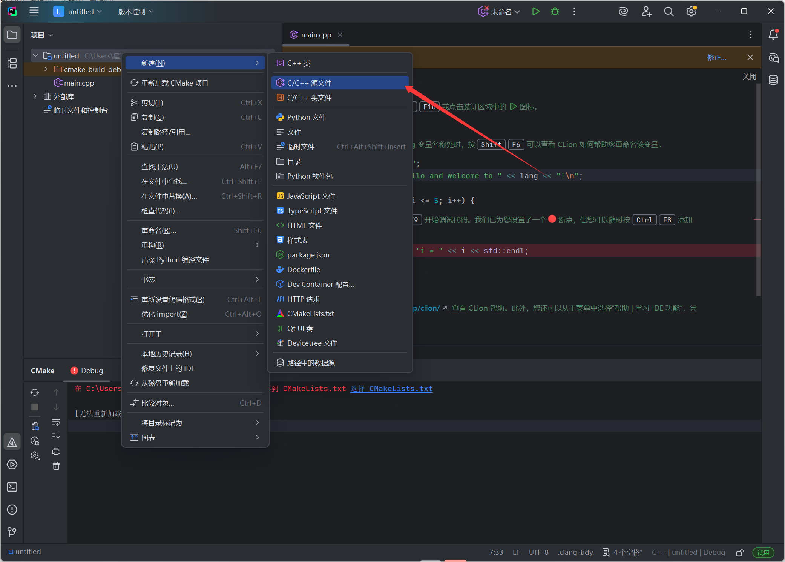

# CLion 配置

CLion 是 JetBrains 出品的 C/C++ IDE，学生可免费申请授权，详见 [JetBrains 许可证申请](../../04-账号与工具/JetBrains/许可证申请.md)。

以下配置的目标是：**同一个项目目录下可以有多个 `.c` 文件，每个文件都能独立右键运行**，不需要 CMake 手动管理。

---

## 第一步：新建项目

打开 CLion，首次启动时选择地区，**不要选中国**，可以选「未指定」或「亚洲（中国除外）」，否则可能影响部分功能。

点击「新建项目」，建立好之后如下图所示，点击「确定」。

---

## 第二步：删除 CMakeLists.txt

项目建立后，删除根目录下的 **`CMakeLists.txt`** 文件。

---

## 第三步：添加运行配置

依次按照以下步骤添加配置，使每个 `.c` 文件都能独立运行。

点击右上角配置下拉框，选择「编辑配置」：

点击左上角 `+` 新增配置：

按下图填写配置内容：

---

## 使用方法

配置完成后，在左侧项目目录中右键 `.c` 文件即可直接运行，同一目录下可以同时存在多个含 `main` 函数的文件互不干扰。

右键菜单中也可以新建文件：

