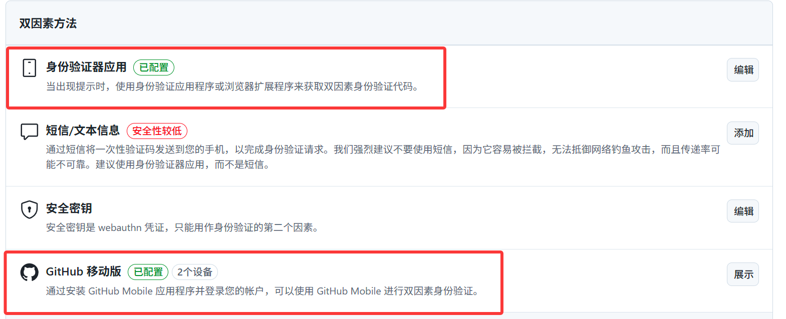
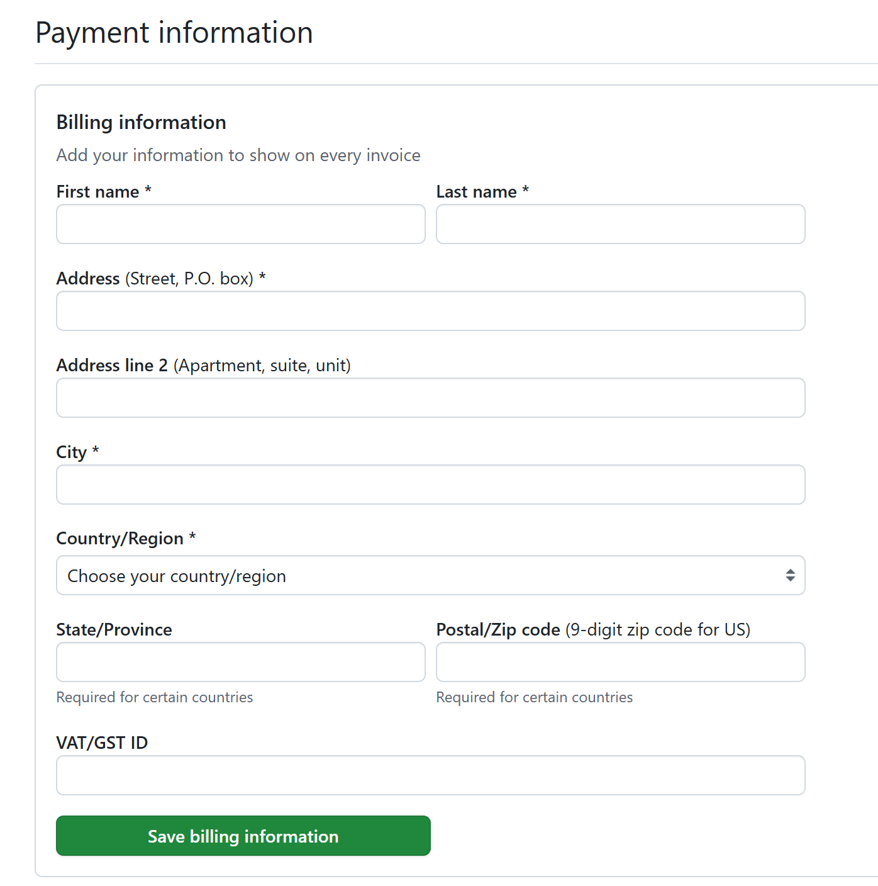
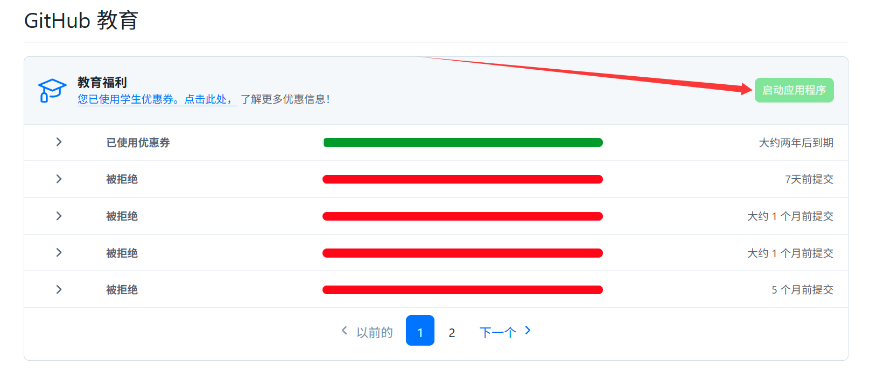
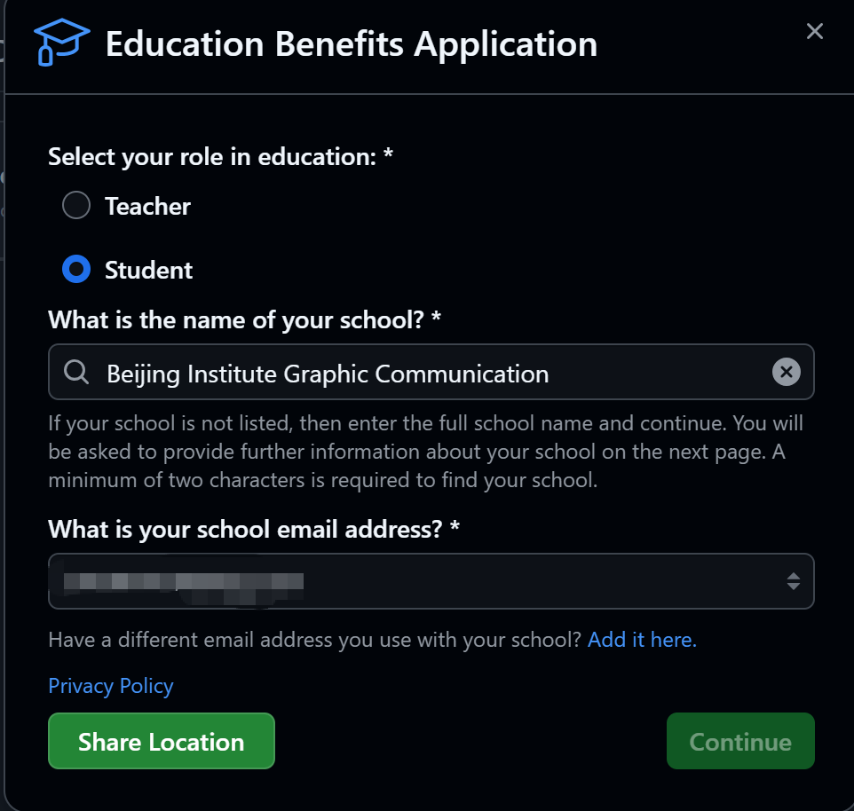
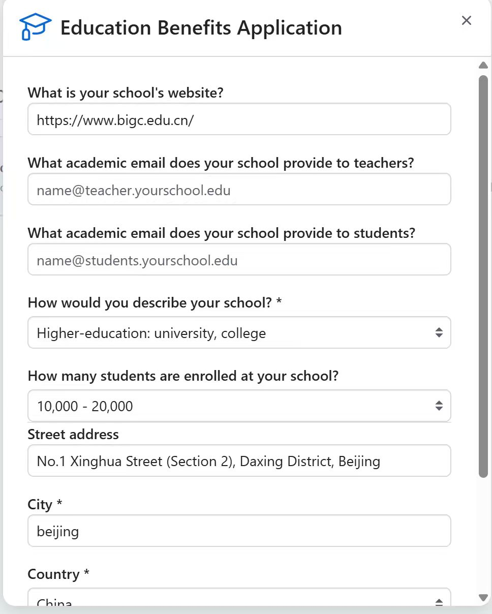
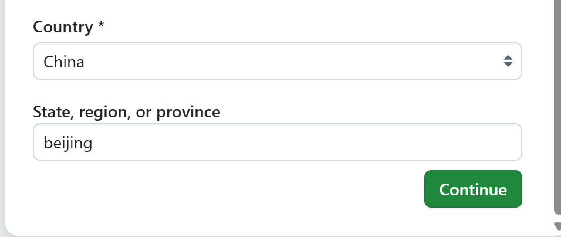
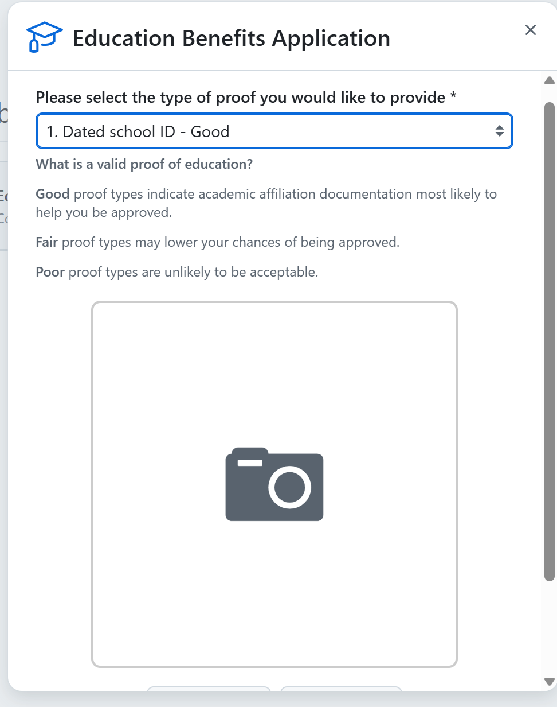

# GitHub 教育优惠申请

申请成功后可获得 GitHub Copilot、Student Developer Pack 等一系列开发者福利。

!!! warning "用学信网在线验证报告，不要用学生证"
    实测学生证审核通过率极低。上传凭证请选择**学信网在线验证报告截图**。
    登录  → 在线验证报告 → 申请/查看 → 截图保存。详见 [JetBrains 许可证申请](../JetBrains/许可证申请.md) 中的学信网操作说明（步骤相同）。

!!! warning "2026年4月起暂停新用户注册"
    自 2026 年 4 月 20 日起，Copilot Pro、Copilot Pro+ 和学生计划的**新用户注册已暂时停止**。已申请的同学福利不受影响。待政策恢复后按本教程操作即可。

---

## 前提准备

### 1. GitHub 账号

### 2. 启用双因素验证（2FA）

推荐使用**身份验证器应用**（Authenticator App）或 GitHub 移动版 App。

身份验证器选项：

- [Google Authenticator](https://play.google.com/store/apps/details?id=com.google.android.apps.authenticator2)（Google Play 下载）
- [Authenticator 浏览器插件](https://authenticator.cc/)（Edge/Chrome 扩展）

### 3. 填写付款信息

!!! warning "姓名必须用英文"
    付款信息中的**姓氏和名字请使用英文拼音**，否则可能导致审核失败。

### 4. Watt Toolkit（加速工具）

**关闭所有 VPN**，连接校园网，打开 Watt Toolkit 对 GitHub 进行加速。选中下图所示服务：

---

## 申请步骤

### 打开申请页面

### 填写基本信息

学校名称填写：**Beijing Institute Graphic Communication**

填写学校网址和地址时，可直接复制以下内容：

- 学校网址：`https://www.bigc.edu.cn/`
- 学校地址：`No.1 Xinghua Street (Section 2), Daxing District, Beijing`

### 上传学信网验证报告

选择第一项「Upload a document」，上传**学信网在线验证报告的截图**，提交即可。

---

提交后通常 **1-5 个工作日**收到审核结果邮件。审核通过后，GitHub Student Developer Pack 中的所有福利自动激活。
