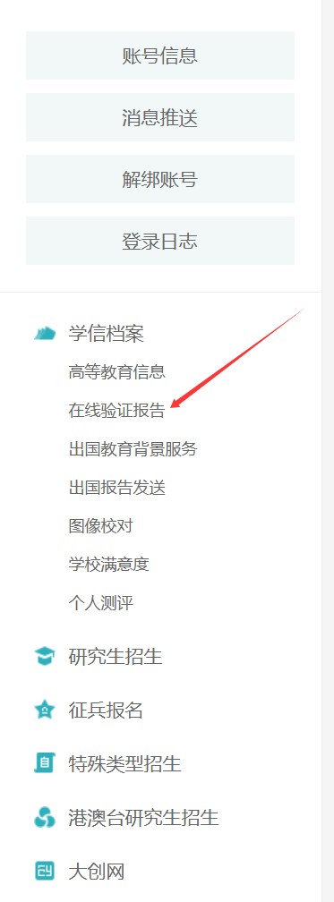
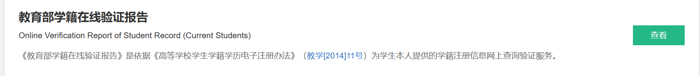
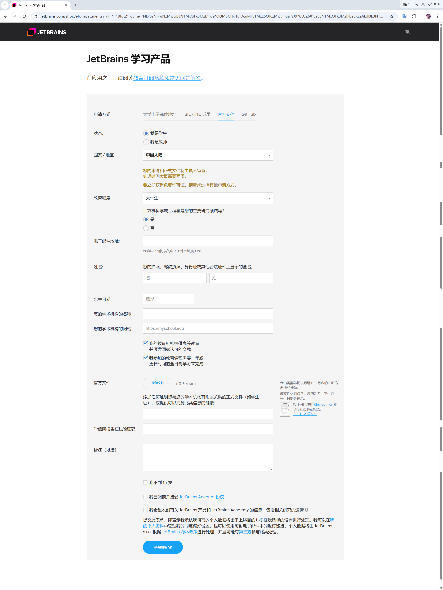

# JetBrains 学生许可证申请

申请成功后可免费使用 IntelliJ IDEA、PyCharm、CLion 等全套 JetBrains IDE，有效期一年，可续期。

---

## 第一步：申请学信网在线验证报告

登录[学信网](https://www.chsi.com.cn/)，点击「在线验证报告」。

- 未申请过的同学需先申请报告
- 已申请的同学确认报告**在有效期内**，过期需延长

申请好之后：**复制在线验证码** → 点击「查看」→ 点击「保存」，将报告文件下载到本地。

---

## 第二步：填写 JetBrains 学生申请表

访问 [jetbrains.com/shop/eform/students](https://www.jetbrains.com/shop/eform/students)，选择 **University email address** 或 **Official document** 方式。

没有教育邮箱的同学选 **Official document**，填写如下：

| 字段 | 填写内容 |
|---|---|
| 学术机构名称 | 北京印刷学院 |
| 学术机构网站 | `https://www.bigc.edu.cn/` |
| 官方文件 | 上传学信网在线验证报告文件 |
| 在线验证码 | 粘贴从学信网复制的验证码 |

提交后通常需要 **约 7 天**收到审核邮件，通过后即可激活全套 IDE。

!!! tip "续期"
    许可证到期前 60 天可凭在校状态续期，操作方式与申请相同。只要还在校就可以一直免费使用。
