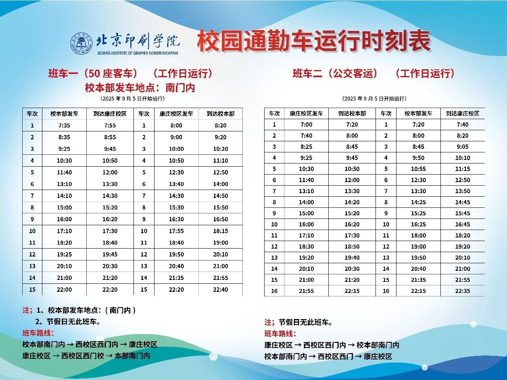
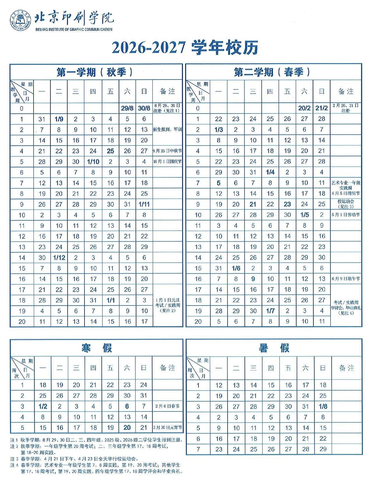

# 其他实用信息

> 待补充 — 欢迎同学们贡献内容。

## 校园 WiFi

- **网络名称**：`SZCXDZMX`
- **登录账号**：校园统一身份认证账号（即教务系统、校园网等通用的账号），**新生需先激活账号**才能登录
- **认证方式**：连接后会弹出认证网页，或顶部显示「WiFi 需要认证」，点击进入登录即可

**连不上 / 掉网怎么办**

苹果设备（iPhone、iPad 等）以及未弹出认证页面时，手动打开浏览器访问：

```
http://172.16.3.200
```

在该页面完成登录验证后即可正常上网。

连接校园网后，可以访问[智慧校园大厅](https://ehall.bigc.edu.cn/)办理或查询校内事务。

## 校园通勤车

校园通勤车分为**班车一（50 座客车）**和**班车二（公交客运）**，图片中的班次按工作日运行，节假日无班车。班车一从校本部南门内发车，班车二从康庄校区发车，具体线路和到站时间见下图。

!!! warning "时刻表可能调整"
    下图标注为 **2025 年 9 月 5 日开始运行**的时刻表，仅作参考；发车时间和线路如有变化，以学校最新通知为准。



## 校历

下图为 **2026—2027 学年校历**，包含秋季学期、春季学期、寒假、暑假以及考试、实践等安排。具体放假时间和教学安排以教务处后续通知为准。



## 学生证

- **补办时间**：每学期第 **5 周**和第 **15 周**
- **补办地点**：N3A 306，找教务处老师办理
- **所需材料**：书面申请说明，并由班主任签字

书面说明没有固定格式，写清楚姓名、学号、班级、补办原因和申请日期即可，打印或手写后交班主任签字。可以参考下面的写法：

```text
学生证补办说明

本人 XXX，学号 XXX，班级 XXX，因 XXX（遗失/损坏/其他原因），现申请补办学生证，情况属实。

申请人：XXX
日期：XXXX 年 XX 月 XX 日

班主任签字：
```

## 学生卡

用于**体测**和**食堂消费**。遗失或损坏可在食堂补办，需要自费。

**充值方式：** 支付宝 → 搜索「**校园派**」→ 绑定学生卡后充值

**进阶：NFC 模拟学生卡**

有能力自费购买硬件读卡器（如熊猫、变色龙等）并开通 **pcr532 软件会员**，可以将学生卡复制到手机 NFC 中，日常刷食堂时直接用手机，无需掏实体卡。

不想自费购买设备的同学，可以联系本手册发起人帮忙操作：[](https://github.com/starnotes-xj)

!!! warning "以下场景 NFC 模拟卡不适用"
    - **体测**：必须使用实体学生卡
    - **缴电费**：仍需在小灵龙 App 中操作，NFC 模拟卡无法支付

## 体测

- **频率**：一年一测
- **补测**：未参加体测的同学后续可参加补测，具体时间学校会另行通知
- **体育课期末考试**：通常分为理论和实操两部分。理论部分一般是老师从题库中抽查题目，现场回答问题，题库会由老师提前发放；实操部分考察本学期实际学习的课程内容，例如武术课需要完整打出学过的一路长拳，具体要求以任课老师通知为准
- **体测时必须使用实体学生卡**，NFC 模拟卡无效

## 电费

- **缴费方式**：通过「**小灵龙**」App 缴费，款项从学生卡余额中扣除
- **电价**：0.5 元 / 度

## 校园卡（电话卡）

入学报名时，中国移动、中国联通、中国电信三大运营商会在校园内搭建帐篷，提供学生专属套餐办理。按需选择，不强制办理。

**套餐参考（中国移动，仅供参考）：**

作者本人选择的是 **800 元两年** 套餐，每月 540 GB 流量：

- 全国通用流量：500 GB
- 校园流量：20 GB
- 北京流量：20 GB

校园网经过升级后速度有所提升，但下载游戏或大型文件时，**用校园卡流量比校园 WiFi 更快更稳定**。

## 图书馆

!!! warning "图书馆暂停使用"
    2024 年 8 月被判定为危房，自 24 级入学起一直处于关闭状态，暂未拆除，**不可入内**。

数字资源（中国知网、万方数据等）仍可在校内网络免费访问。

## 常用地点

| 地点 | 位置 |
|---|---|
| 信息工程学院楼 | N3A |
| 教务处 | N3A 306 |

## 常用联系方式

| 部门 | 联系方式 |
|---|---|
| 信息工程学院办公室 | 待补充 |
| 网络中心（校园网报修） | 待补充 |
| 学生处 | 待补充 |

---

!!! note "如何贡献"
    如果你了解以上信息，欢迎提 PR 补充，帮助后来的同学。
