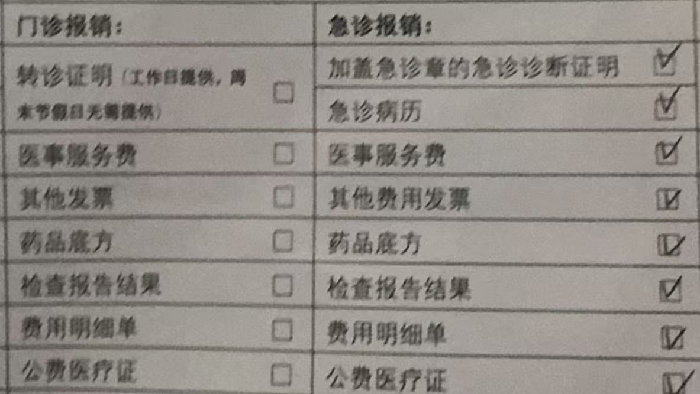

# 学生公费医疗

> 最短流程：先到校医院就诊；工作日前往合同医院时，先在校医院开转诊证明；再去医院挂号、检查、开药、保留全部材料，最后按要求提交报销。

!!! warning "最容易踩坑的一条"
    工作日去合同医院门诊或住院，必须提前在校医院开具转诊证明，并在挂号处加盖转诊专用章；转诊证明不能后补。急诊、周末及节假日门诊按规定执行，不受普通工作日转诊流程限制。

## 官方全文

[北京印刷学院《学生公费医疗管理规定》——学校后勤处官网全文](https://houqin.bigc.edu.cn/gzzd/90cff998ed9144749a50eae49b684d2b.htm)

该规定明确：享受公费医疗的学生必须实名制就医，并凭学校统一发放的公费医疗证就诊和报销；规定自 **2025 年 7 月 8 日**起施行，之前发布的旧规定同时废止。

!!! note "公费医疗证"
    学校目前已实现公费医疗证电子化。具体出示、核验方式以校医院和学校最新通知为准。

## 先看这一套流程

1. **先去校医院**：能在校医院诊治的疾病，原则上应在校医院完成，不要直接去合同医院。
2. **需要转诊时开证明**：工作日前往合同医院前，先由校医院医师评估并开具转诊证明，再到挂号处加盖转诊专用章。
3. **去合同医院就诊**：目前规定列明的合同医院包括北京市大兴区人民医院、北京友谊医院。
4. **保留全部材料**：公费医疗证、转诊证明、发票、费用明细、处方底方、检查或化验报告等都不要丢。
5. **提交报销**：按住宿情况和学校要求提交材料；所有材料初审合格后原则上不退回，建议提前拍照或复印留存。

## 普通门诊

### 工作日

- 先在校医院就诊，由校医院判断是否需要转诊。
- 转诊证明应注明就诊内容；不同疾病需要分别开具转诊证明。
- 转诊证明有效期为 **14 天**（从开具当日算起）。同一疾病在有效期内复诊，不需要重复开具，但该有效期内的报销材料需要一次性提交；如果分次提交，后续复诊前可能需要重新转诊。
- 如果合同医院判断还需要去其他医院或专科医院，应由合同医院医师评估并开具北京市统一的公费医疗转诊证明。

### 周末及节假日

需要门诊就诊时，可以直接前往合同医院，无需校医院转诊证明；但费用仍须符合公费医疗规定，且要保留完整报销材料。

## 急诊

- 急症可以直接到合同医院或就近的医保定点医院急诊，不受普通工作日转诊流程限制。
- 慢性病不属于临时急症的，仍应提前办理转诊；否则相关费用可能由个人承担。
- 急诊通常只报销**首次急诊就医**产生的费用，药品一般限 **3 天以内**用量；急诊复诊、慢性病急诊、中药费用等不在规定报销范围内。
- 急诊报销需保留：公费医疗证、急诊病历、加盖红章的急诊诊断证明、药品处方底方、化验或检查报告、费用明细单、急诊发票。

## 寒暑假

- 寒暑假期间校医院不开具转诊证明，普通门诊仅限乡镇、街道及以上医保定点医院。
- 普通门诊纳入公费医疗报销范围的费用上限为 **500 元（含）**；挂号时就诊身份必须选择“公费医疗”，否则不予报销。
- 急症或危重症可直接前往就近的乡镇及以上医保定点医院急诊，按急诊材料和规定办理。
- 慢性病、癌症、肿瘤、血液透析、放化疗等特殊病种需要假期继续治疗的，应在放假前持诊断证明到校医院备案。

## 住院

- 急症住院：可以经急诊直接在医保定点医院住院。
- 非急症住院：应提前在校医院开具转诊证明，再到合同医院住院；如需转到其他医院，须按合同医院开具的北京市公费医疗转诊证明办理。
- 住院报销材料包括：公费医疗证、转诊证明或急诊病历及急诊诊断证明、住院病历、加盖红章的出院诊断证明书、出院记录小结、加盖红章的住院结算费用明细单、住院费用发票等。
- 住院费用原则上应在出院后 **7 天内**到校医院办理审核申报。

## 报销材料清单

下图为门诊和急诊报销材料清单示意。实际提交前，仍应以校医院当次要求和学校最新通知为准。

| 场景 | 建议准备的核心材料 |
|---|---|
| 普通门诊 | 公费医疗证、药品处方底方、化验或检查报告、费用明细单、门诊发票、转诊证明（工作日需要） |
| 急诊 | 公费医疗证、急诊病历、加盖红章的急诊诊断证明、药品处方底方、化验或检查报告、费用明细单、急诊发票 |
| 住院 | 公费医疗证、转诊或急诊材料、住院病历、出院诊断证明书、出院记录小结、住院费用明细单、住院发票 |

## 哪些情况可能无法报销

以下情况按官方规定通常不予报销或需个人承担：

- 新生入学前已有疾病，入学后继续维持原治疗；
- 工作日未经过校医院转诊就去合同医院，或擅自前往非合同医院；
- 打架、酗酒、自伤、自残、美容、正畸、镶牙、交通事故等规定范围外费用；
- 急诊非首次就诊、首次急诊开具 4 天及以上药量、急诊产生的慢性病及中药费用，或同一时间在两家及以上医院急诊；
- 自行购买药品、跨年度医疗费用，以及其他不符合公费医疗管理规定的费用。

校外就医票据的“费用类别”必须显示为 **公费**；显示为“自费”或“医保”的票据，按官方规定不予报销。

## 个人负担比例（摘要）

- 校医院就诊：个人负担 **10% 及以上**，通常实时结算，无需再次报销。
- 经转诊到合同医院或专科医院：年度门诊医疗费 3000 元（含）以下部分，扣除全自付和部分自付后，个人负担 20%；超过 3000 元的部分，个人负担 10%。
- 符合规定的急诊非合同医院费用：个人负担 30%。
- 药品目录外用药、部分大型检查、贵重医用材料等可能先由个人承担一定比例，具体以官方规定和医院审核为准。

## 提交时间、地点与到账

- 在校住宿学生：按报销材料附件清单，将材料交到所在宿舍楼一层值班室。
- 非在校住宿学生或双培生：正常教学期间，每周三 **13:30—16:30** 到学校医务室提交材料。
- 门诊报销：正常情况下，当月提交的费用最快于次次月月初打入学生个人银行卡。
- 当年发生的医疗费用应在当年完成报销，具体截止时间以学校通知为准。
- 所有提交的报销材料初审合格后原则上不退回，提交前务必自行备份。

## 联系方式

- **医疗咨询电话**：010-60261211
- **后勤处官网**：[houqin.bigc.edu.cn](https://houqin.bigc.edu.cn/)
- 具体报销口径、材料接收安排和最新政策，以校医院、后勤处和学校最新通知为准。

!!! tip "记忆版"
    工作日：先校医院、再转诊、后去合同医院；急诊：先救治、留齐急诊材料；所有情况：实名就医、保留发票和明细、不要跨年提交。
