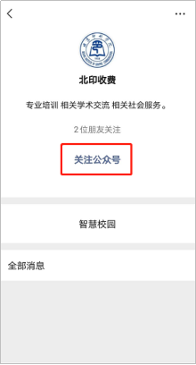
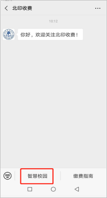
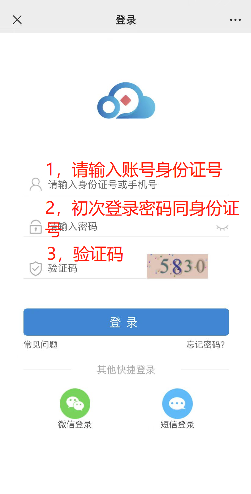
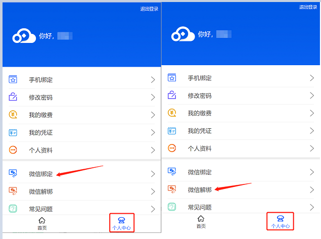
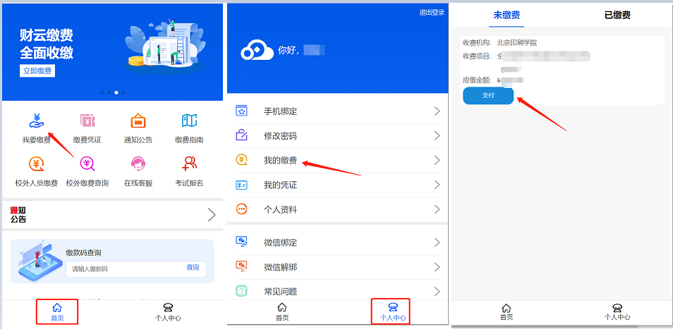
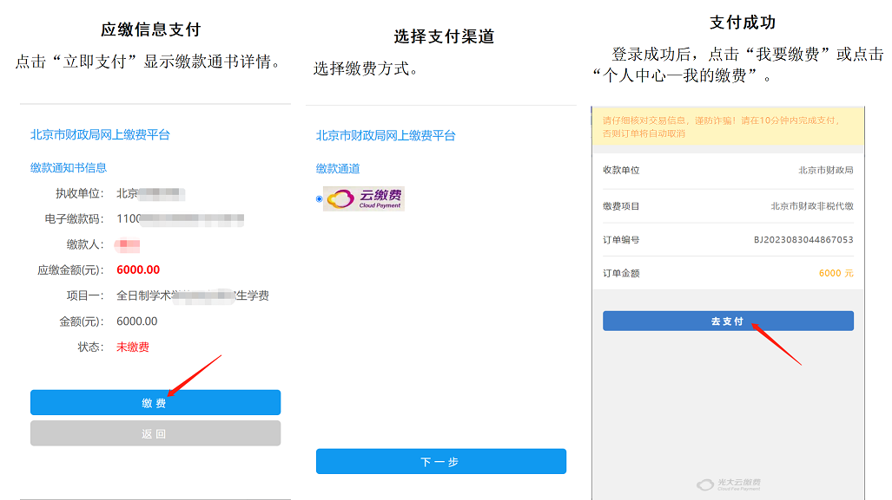
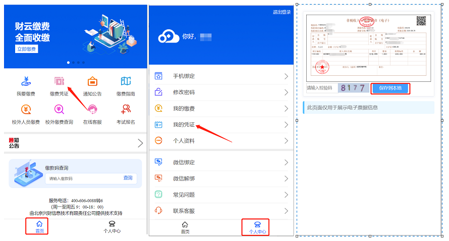
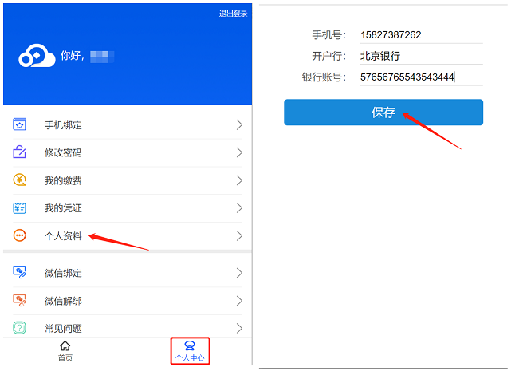

# 学生移动端缴费指南

> 本文转自「北印收费」微信公众号，原发布日期：2023 年 8 月 30 日。

开学前最重要的待办事项之一：**缴学费和住宿费**。学校通过「北印收费」微信公众号平台完成收费，按以下步骤操作即可。

!!! info "住宿费标准"
    住宿费根据学校最终安排的宿舍确定，常见标准为 **750 元、900 元或 1200 元**。宿舍由学校统一安排，不能自行选择住宿费档次；具体应缴金额以「北印收费」中的缴费明细为准。

---

## 注意事项

!!! warning "缴费前请注意"
    1. 请确保缴费前，**微信支付绑定的银行卡余额**或**微信余额**足够支付缴费金额。
    2. 点击「微信支付」后请按流程完成支付，若中断支付，请**半小时后**在「待付款」中继续支付。

---

## 生源地助学贷款

如果你已经申请了生源地助学贷款，贷款预计覆盖的学费和住宿费部分**不要重复缴纳**。学校录入回执、贷款发放后会统一抵扣；如果贷款金额不足以覆盖全部费用，再按学校通知补缴差额。

1. **登录「北印收费」**：按下方操作步骤完成前三步（关注 → 进入系统 → 登录），确认账号正常可登录。
2. **开学后交贷款回执**：开学后按照学校通知，提交生源地助学贷款回执单（具体时间和方式辅导员会通知）。提交后保留受理证明、回执校验码或提交记录，方便后续查询。
3. **办好北京银行卡后填写卡信息**：参照[北京银行卡办理指南](../银行卡办理/北京银行卡.md)办好卡后，登录北印收费，按第七步填写银行卡信息，用于后续奖学金、补助发放。

!!! info "贷款什么时候到账？"
    按往年办理情况，较早的批次可能在 **10 月底**到账，较晚的可能要到 **11 月底至 12 月初**。具体时间会因生源地、经办银行和当年批次而变化，以当年通知和实际到账为准。

    贷款到账后，学校抵扣和「北印收费」状态更新也可能有延迟。等待期间页面仍显示“未缴费”不一定代表办理失败，先不要重复支付，可以保留页面截图并留意辅导员通知。

!!! tip "提前做好资金安排"
    如果计划使用贷款扣除学费、住宿费后的余款作为生活费，不要按最早到账时间安排支出。建议至少准备能维持到 **12 月初**的生活费和必要开支。

!!! warning "先核对额度，再决定是否补缴"
    - **贷款金额足够覆盖学费和住宿费**：等待学校统一抵扣，无需重复缴纳。
    - **贷款金额不足**：只补缴未覆盖的差额，具体金额和时间以学校通知为准。
    - **已经误缴全额**：不要自行猜测退款方式，及时联系辅导员或学校财务处，提供缴费凭证和贷款信息确认后续处理。

---

## 操作步骤

### 第一步：关注「北印收费」

微信扫描下方二维码，关注「北印收费」公众号。

### 第二步：进入系统

打开「北印收费」公众号，点击下方菜单栏的「**智慧校院**」进入系统。

### 第三步：登录

进入登录页面后：

- **用户名**：学生身份证号
- **初始密码**：身份证号 18 位（含字母的需大写）

输入后点击「登录」。

### 第四步：绑定微信（建议）

登录成功后，点击「个人中心」，可以绑定当前微信号。绑定后下次可直接使用微信登录，无需重复输入身份证号。

!!! tip "更换微信号"
    如果后续更换了微信号，先在旧号中点击「微信解绑」，再用新号重新绑定。

### 第五步：缴纳费用

在首页点击「**我要缴费**」，或进入「个人中心」查看具体缴费明细，确认无误后点击「支付」进入缴费流程。

!!! note "生源地助学贷款学生"
    贷款预计覆盖的部分请**跳过此步**。贷款金额不足的同学，按学校通知补缴差额，不要重复支付全额费用。

### 第六步：查看缴款凭证

支付完成后，可在首页查看「缴款凭证」，或进入「个人中心」→「我的凭证」查看缴费状态（已缴费 / 未缴费）及缴款凭证详情。

### 第七步：填写银行卡信息（重要）

首页 →「个人中心」→「个人资料」，填写并保存银行卡信息。学校后续的奖学金、补助等发放会用到此卡信息。

---

!!! info "说明"
    缴费操作步骤来源于「北印收费」微信公众号官方指南；贷款到账时间为往年办理经验，仅供参考。操作界面和具体安排可能随系统及当年政策变化，以学校最新通知为准。
